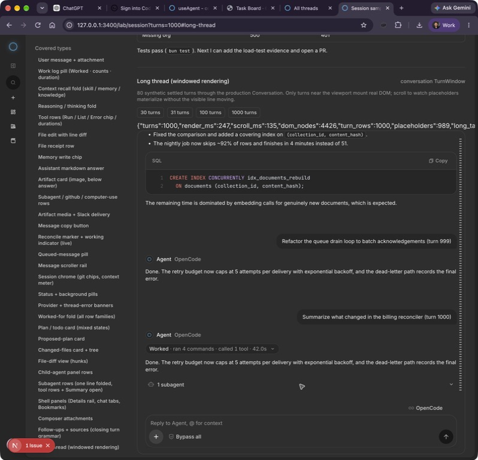
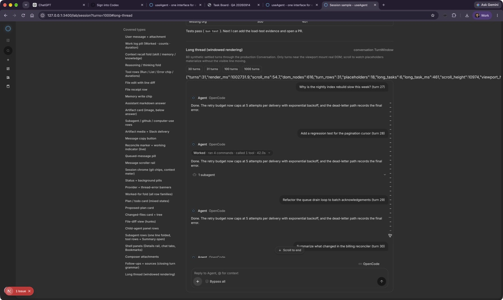
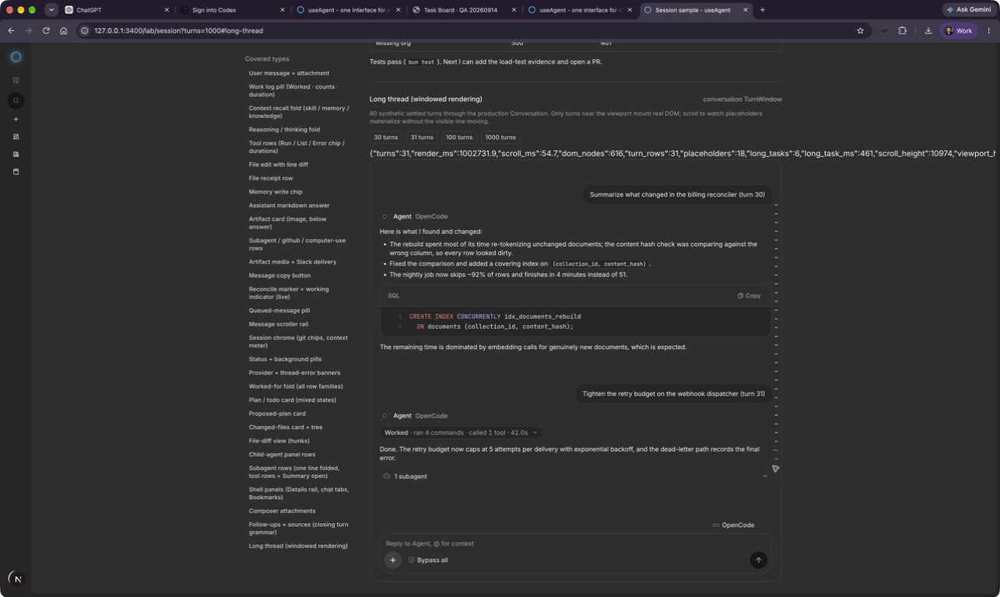

# Long-history tail navigation

Reproduction uses the existing production Conversation fixture at `/lab/session?turns=1000#long-thread`, with the frontend pointed at an unused local API port. No production data is created.

Before the fix, click the long-thread Scroll to end control after its initial midpoint measurement. The viewport advances from roughly turn508 to531, then remains there. A second click moves to547, still far from1000. Smooth scrolling is interrupted by virtual row height corrections writing scrollTop.

The fixed control jumps synchronously. The same real-browser test reaches turn1000 and hides the tail-jump control; screenshot below. Ordinary manual scrolling and keyboard/button semantics are unchanged.

The fixture proves client windowing behavior only, not server pagination or native-provider long-context behavior. Its manual-toggle render_ms measurement reuses a stale start timestamp, so those timing figures are not performance evidence.

The sibling turn rail showed the same failure just over the virtualization boundary: clicking turn 31 stopped around turns 27-30. Its jump now uses the same synchronous behavior and retains the existing 8-pixel inset. The retest reaches turn 31.

Cleanup review scope: both navigation controls and their regressions. The unused reduced-motion helper was removed; no fallback path, timing heuristic, dependency or shared programmatic-scroll state was added. The helpers test the synchronous DOM-property behavior. The dense rail's 1000-turn accessibility remains separately unverified; this does not claim every possible navigation scenario passed.
