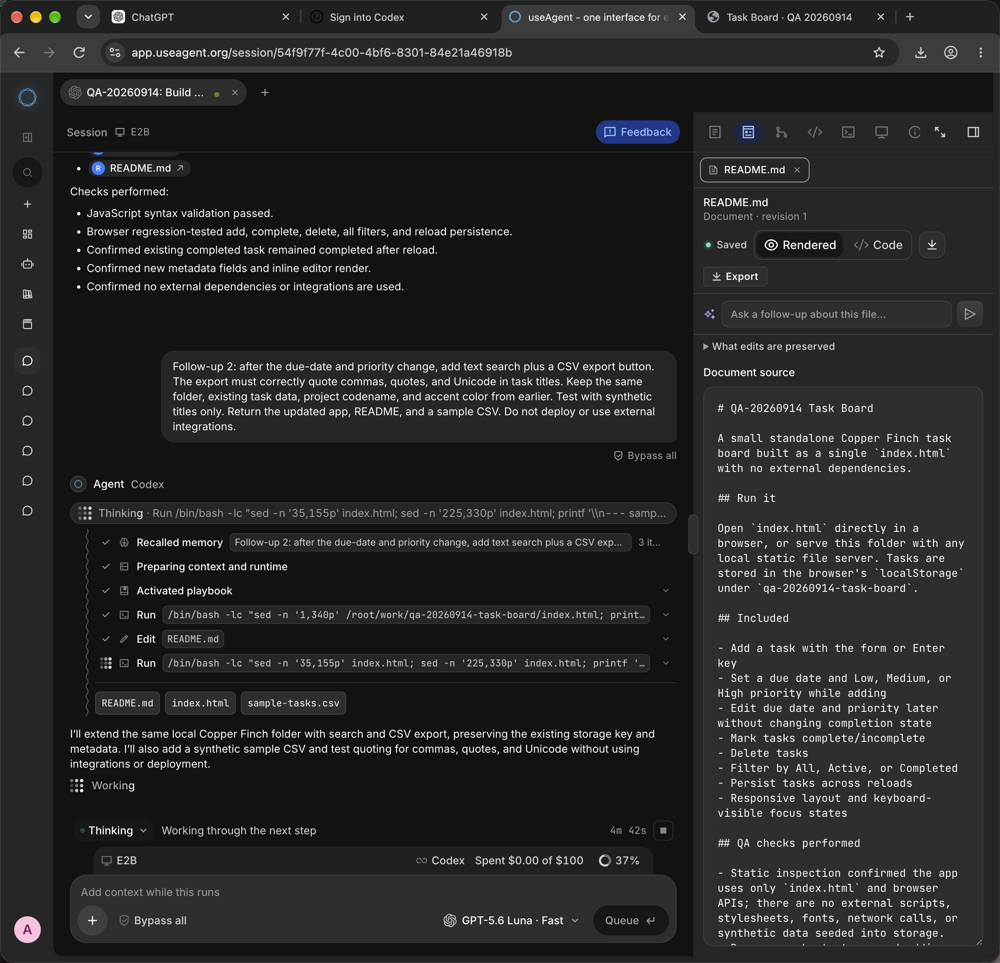
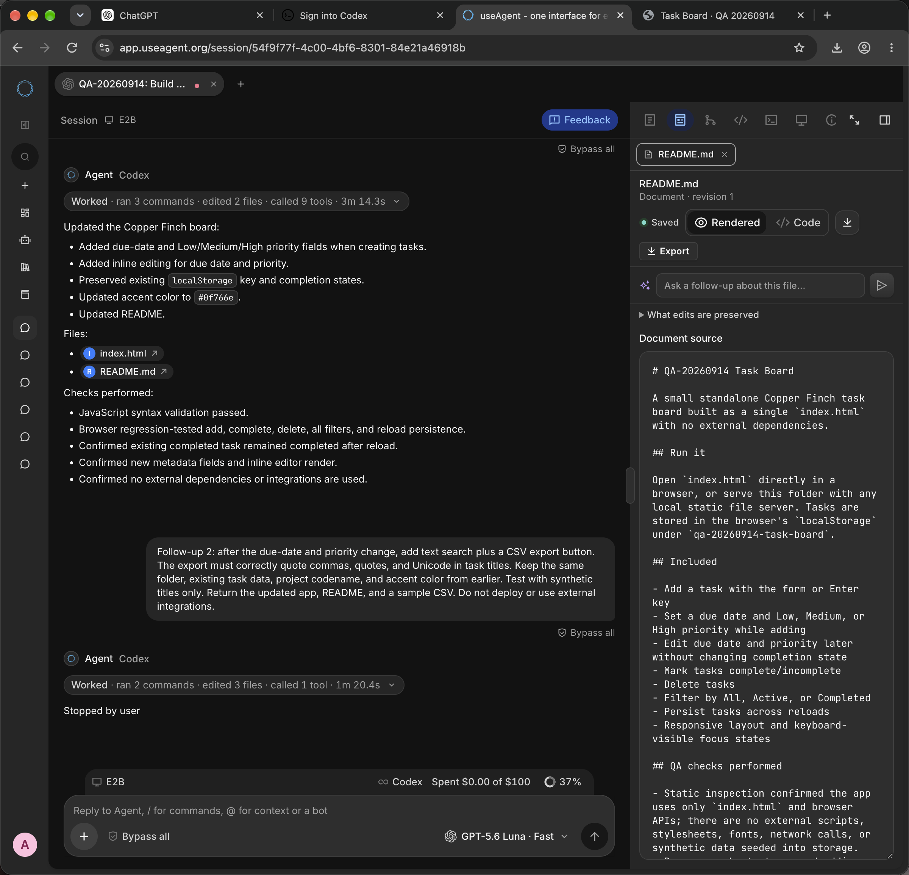

# Running elapsed must not include queue wait

Observed through the real useAgent Pro UI in Chrome on 2026-09-14 (IST), with synthetic QA data only. Production release observed during the test: `c41379850fa0160c3866a4c24f2ca3119bf5aa6a`.

## Reproduction

1. Start a feature-building task in a new disposable workspace.
2. Queue follow-up work while the first turn runs.
3. Reload the conversation; confirm the queued follow-up remains.
4. Let the follow-up start and read the running footer's elapsed timer.
5. Stop that QA turn and compare the settled duration with its execution timestamps.

QA thread: `54f9f77f-4c00-4bf6-8301-84e21a46918b`.
Affected queued turn: `2f721a40-89e5-4d2f-af84-e250e580da65`.

The live footer displayed **4m 42s**, while the stopped work log reported **1m 20.4s**. The running timer was using acceptance time and included more than three minutes spent waiting for the preceding turn.

Read-only, thread-scoped database verification returned:

| Field | UTC value |
| --- | --- |
| Accepted (`created_at`) | 2026-09-13T22:31:24.701Z |
| Durable worker start (`steps`, index 0, task/boot/preparing) | 2026-09-13T22:34:48.081Z |
| Prompt delivered | 2026-09-13T22:34:54.311Z |
| Settled after Stop | 2026-09-13T22:36:09.115Z |
| Recorded completed duration | 80,391 ms |

The worker-start clock includes preparation; it is not expected to equal the adapter's settled duration exactly. The defect is counting queue wait as running time.

## Live screenshots

These are **before-fix production evidence**, not a claim that this branch was deployed.

## Repair and regression coverage

- Reuse the existing durable worker-start marker for footer and transcript elapsed labels.
- Hide elapsed when a trustworthy start marker is unavailable; never substitute acceptance time.
- Preserve queued waiting UI and settled durations.
- Regression tests exercise a synthetic five-minute queue wait followed by 65 seconds of execution, absent/invalid markers, native transcript rendering, and replay/reload.

No production services were restarted or modified for this reproduction. Only the QA-owned turn was stopped. The branch has not been merged or deployed.
