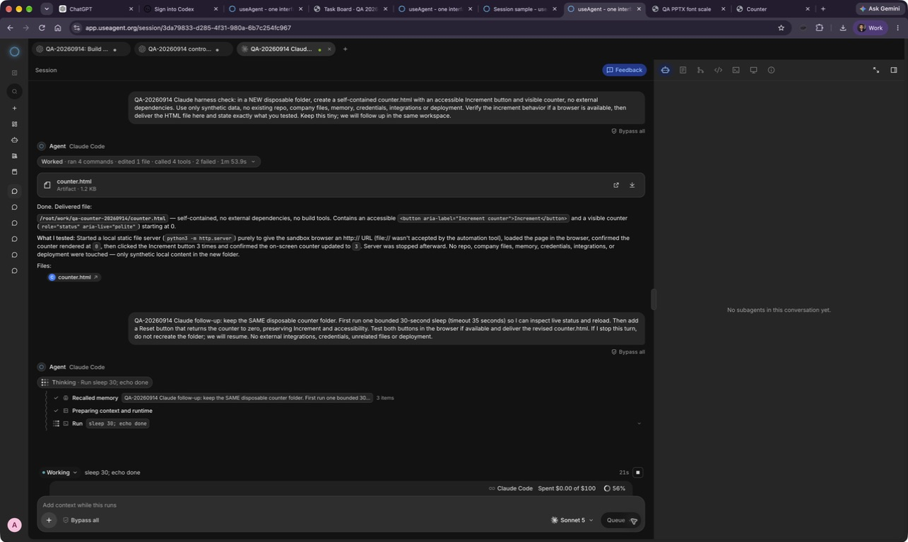
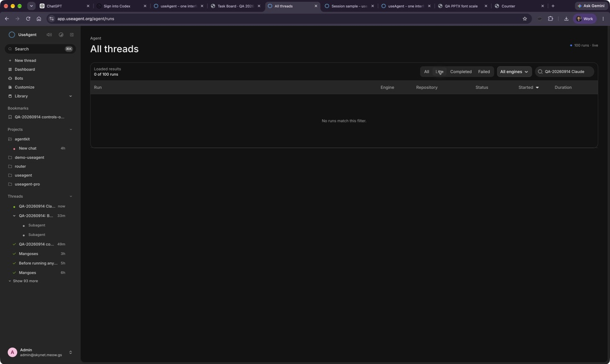

# Latest thread status in All threads

Live QA used the Claude thread `3da79833-d285-4f31-980a-6b7c254fc967`. Its first turn completed. Follow-up `d4d18956-21d6-4c8d-a387-c532ba8ce30e` was running in the same sandbox when All threads' Live filter and the QA-title search returned no matches.

A read-only query scoped to this QA thread confirmed root status completed and follow-up status running. The API already supplies latest_status; the page used the root status for dots, chips and filters instead.

The fix consistently uses latest_status and treats queued as Live only inside this page. Root identity/title and shared sidebar presentation remain unchanged. Regression tests cover the root-completed/latest-running, latest-failed and latest-queued cases. Screenshots are before-fix production evidence; no production deployment is claimed.
